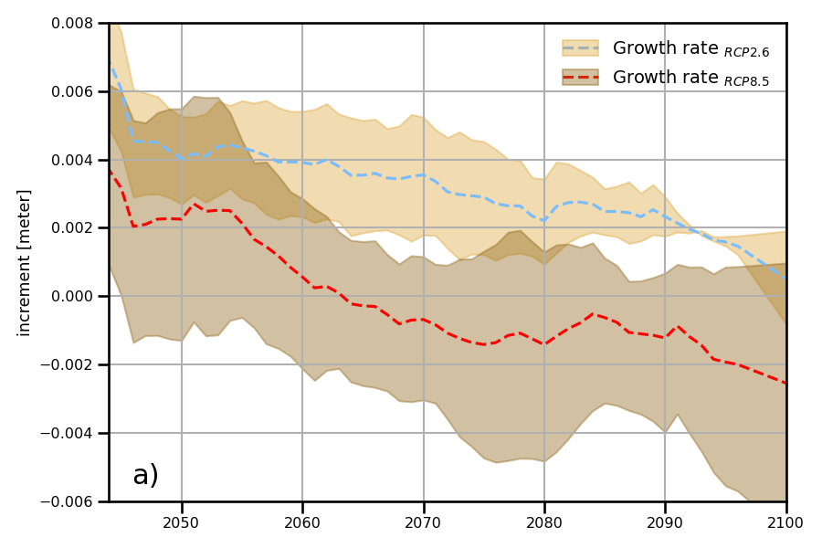
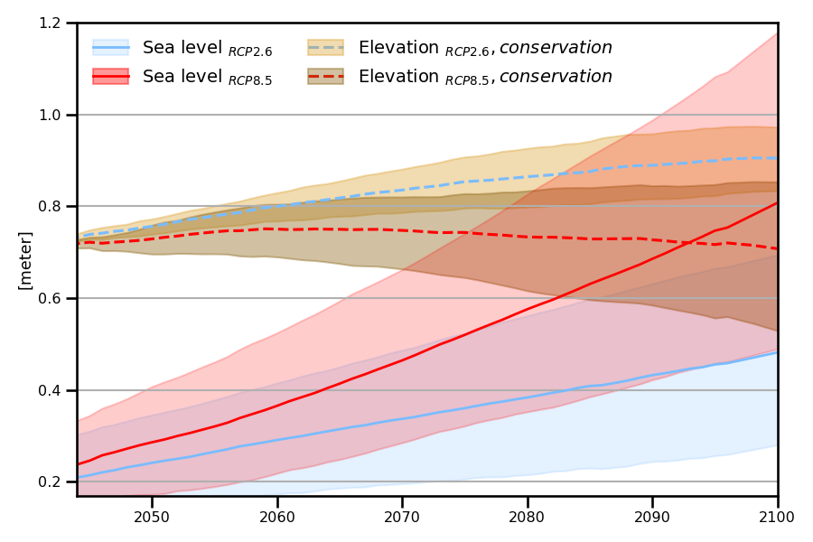

Simulating marsh-accretion trajectories 
-----------------------------------------

Illustration of the effects of two management strategies (L) — marsh
conservation (top) and marsh restoration (bottom) for a fixed set of
categorical input parameters and the high and low emissions sea level
rise scenarion RCP8.5 and RCP2.6 (X) on marsh accretion rates.

Load plotting data
~~~~~~~~~~~~~~~~~~

To simulate the marsh accretion time series, inputs from the high and low emissions sea level rise scenarios RCP2.6 and
RCP8.5 were used. Following AR5 projections (`Church et al., 2013 
<https://www.cambridge.org/core/books/abs/climate-change-2013-the-physical-science-basis/sea-level-change/8B46425943EA6EEB0DE30A7B2C8226FE>`_), the regional sea level rise data anchored to the 1986–2005 baseline period, were provided by the Integrated Climate Data Center (ICDC) at the University of Hamburg’s Center for Earth System Research and Sustainability (CEN). For each concentration pathway RCP2.6 or RCP8.5, the projected sea level rise rates as well as absolute levels are stored for the upper, lower and central estimate in the 5–95 \% confidence interval of CMIP5 projections. Tidal elevations data was sourced from the Climate Data Store. The simulations provided used the Global Tide Surge Model (GTSMv3.0) 
(`Muis et al., 2020 <https://www.frontiersin.org/journals/marine-science/articles/10.3389/fmars.2020.00263/full>`_) and incorporate the IPCC scenarios.

Data loading and preparation
^^^^^^^^^^^^^^^^^^^^^^^^^^^^^^
In this example, all categorical input parameters of the ``marsh_elevation_model`` remain constant, while the sea-level rise and tidal elevation time series vary depending on the selected RCP scenario and associated uncertainty level (low, mean, or high). For loading and preparing the data, we utilize the following python libraris first.

    import pandas as pd
	import numpy as np

.. code:: ipython3

	z_init = 0.7               # Initial elevation in pioneer zone
	c_flood = 0.05             # Low background sediment concentration
	rho_deposit = 400          # Low dry buld density due to low mineral content of suspended sediments 
	s_subsidence = 0.003       # Autocompaction rate
	c_flood_nourishment = 0.0  # Policy: No nourishment strategy
	nourishment_frequency = 1  # No nourishment every year
	fd = 0.4                   # Policy: Conservation, basically means do nothing
	slr_rcp_85 = pd.read_csv('model_input_X_L/slr85.csv', sep=',')
	slr_rcp_26 = pd.read_csv('model_input_X_L/slr26.csv', sep=',')
	tides_per_year = pd.read_csv('model_input_X_L/tides_rcp85_S15.tsv', sep='\t')

Next, we organize the sea-level rise and mean sea-level time series into a dictionary (``slr_series_dict``) to facilitate iteration through different scenarios in the ``marsh_elevation_model``. Each entry corresponds to a specific RCP (2.6 or 8.5) and uncertainty level (low, mean, high), allowing efficient processing of multiple future sea-level trajectories.
 
.. code:: ipython3

	scenarios = [
		('result_low_26',  slr_rcp_26, 'delta_min_slr',  'min_slr'),
		('result_mean_26', slr_rcp_26, 'delta_mean_slr', 'mean_slr'),
		('result_high_26', slr_rcp_26, 'delta_max_slr',  'max_slr'),
		('result_low_85',  slr_rcp_85, 'delta_min_slr',  'min_slr'),
		('result_mean_85', slr_rcp_85, 'delta_mean_slr', 'mean_slr'),
		('result_high_85', slr_rcp_85, 'delta_max_slr',  'max_slr'),
	]

	slr_series_dict = {
		name: df[['year', delta_col, msl_col]].rename(
			columns={delta_col: 'slr', msl_col: 'msl'}
		)
		for name, df, delta_col, msl_col in scenarios
	}
    
This loop runs the marsh_elevation_model for each sea-level rise scenario by merging the corresponding time series with tidal data. The results—marsh elevation, elevation change rate, and mean sea level—are stored in a dictionary (``results``) for plotting.

.. code:: ipython3

    results = {}

	for result_name, slr_series in slr_series_dict.items():
		merged_data = tides_per_year.merge(slr_series, on='year', how='left')
				
		msl = slr_series['msl']
		z_vals, years, dz_vals = marsh_elevation_model(
			z_init=z_init,
			c_flood=c_flood,
			c_flood_nourishment=c_flood_nourishment,
			fd=fd,
			rho_deposit=rho_deposit,
			s_subsidence=s_subsidence,
			nourishment_frequency=nourishment_frequency,
			tides_per_year=merged_data
		)
		 

		results[result_name] = pd.DataFrame({
			'year': years,
			'elevation': z_vals,
			'dz_dt': dz_vals,
			'msl': msl,
		})

The resulting time series are stored as separate .txt files in the ``model_output_M folder``.

.. code:: ipython3

	for result_name, df in results.items():
		df.to_csv(f'model_output_M/Accretion_time_series/{result_name}.txt', sep='\t', index=False)
		
		
The time series output from each scenario is now stored in the ``results`` dictionary, where the keys (``result_name``) identify the scenario and the values contain the corresponding time series as DataFrames. To avoid repeatedly accessing them with ``results[result_name``] in the plot command, we unpack the dictionary into individual variables in the global namespace. Each key becomes a standalone variable name, directly assigned to its associated DataFrame for more convenient access in later analysis or plotting.

.. code:: ipython3
	for name, df in results.items():
		   globals()[name] = df		
		   

The final step in data pre-processing before plotting involves smoothing the accretion time series with the Savitzky-Golay filter. This step serves purely aesthetic purposes, helping to create cleaner and more visually appealing plots without altering the underlying trends.

.. code:: ipython3

    window_size = 10  # Window size must be odd
    poly_order = 1
    smoothed_mean_26 = savgol_filter(result_mean_26['dz_dt'], window_size, poly_order)
    smoothed_high_26 = savgol_filter(result_high_26['dz_dt'], window_size, poly_order)
    smoothed_low_26 = savgol_filter(result_low_26['dz_dt'], window_size, poly_order)
    
    smoothed_mean_85 = savgol_filter(result_mean_85['dz_dt'], window_size, poly_order)
    smoothed_high_85 = savgol_filter(result_high_85['dz_dt'], window_size, poly_order)
    smoothed_low_85 = savgol_filter(result_low_85['dz_dt'], window_size, poly_order)
    
    

Plot commands
^^^^^^^^^^^^^^^
Now the time series created with the ``marsh_accretion_model`` code are ready to be visualized, using the following necessary packages and libraries for this task.
 
.. code:: ipython3

    
	import matplotlib.pyplot as plt
	from scipy.signal import savgol_filter 
	import seaborn as sns
	
With the following code we will create the plot, which shows the simulated annual marsh elevation changes under two contrasting sea level rise scenarios:  
.. code:: ipython3

	fig, ax1 = plt.subplots(figsize=(9,6))  # adjust size as needed

	### RCP 2.6
	### marsh-growth
	p1_26 = ax1.plot(result_low_26['year'], smoothed_mean_26, linestyle='--', color='#79BCFF')
	ax1.fill_between(result_low_26['year'], smoothed_low_26, smoothed_high_26, color='#DDA63A', alpha=0.4)

	### RCP 8.5
	### marsh-growth
	p1_85 = ax1.plot(result_mean_85['year'], smoothed_mean_85, linestyle='--', color='#FF0000')
	ax1.fill_between(result_mean_85['year'], smoothed_low_85, smoothed_high_85, color='#8C6518', alpha=0.4)

	ax1.set_xlim(2044, 2100)
	ax1.set_ylim(-0.006, 0.008)
	###############    Customize legend    ####################
	#Create an invisible fill to use in the legend.
	p2_26 = ax1.fill(np.NaN, np.NaN,  color='#DDA63A', alpha=0.4)
	p2_85= ax1.fill(np.NaN, np.NaN,  color='#8C6518', alpha=0.4)

	handles = [(p1_26[0], p2_26[0]), (p1_85[0], p2_85[0])]
	labels = [r'Growth rate $_{RCP 2.6}$', r'Growth rate $_{RCP 8.5}$']

	ax1.legend(handles, labels, handleheight=1, loc='best',frameon=False, prop={'size': 14})

	ax1.set_ylabel('increment [meter]')
	ax1.grid(True)

	ax1.annotate(
		r'a)',
		xy=(2047, -0.0050),
		xytext=(2047, -0.0055),  # Position of text slightly above and to the right
		ha='center',fontsize=22
	)

	# Set the context to increase overall font size
	sns.set_context("talk", font_scale=0.7)

	# Adjust layout to prevent overlapping
	plt.tight_layout()
	plt.savefig('accretion_rate_pio_S15_conservation.png')
	plt.show()

   Simulated marsh growth rate time-series ``(n=6)`` in the pioneer zone in focus area 15 with fixed categorical, uncertain parameters.  
   The simulations were performed using water level inputs from the high and low emissions scenarios RCP 2.6 and RCP8.5 (X).

  

Next, we will plot the corresponding elevation time series together with the sea level rise under low and high emissions scenario. The times where an elevation trajectory intersects with the corresponding sea level trajectory indicate an approaching system shift - the marsh drowning.

.. code:: ipython3

	fig, ax2 = plt.subplots(figsize=(9,6)) 

	### RCP 2.6
	### marsh-growth
	p1_26_E = ax2.plot(result_mean_26['year'], result_mean_26['elevation'], label=r'$z_{marsh}$',  linestyle='--', color='#79BCFF')
	ax2.fill_between(result_mean_26['year'], result_low_26['elevation'], result_high_26['elevation'], color='#DDA63A', alpha=0.4)

	### sea-level-rise
	p1_26_slr = ax2.plot(result_mean_26['year'], result_mean_26['msl'], linestyle='-', color='#79BCFF',linewidth=2)
	ax2.fill_between(result_low_26['year'], result_low_26['msl'], result_high_26['msl'], color='#79BCFF', alpha=0.2)

	#### RCP 8.5
	### marsh-growth
	p1_85_E = ax2.plot(result_mean_85['year'], result_mean_85['elevation'], label=r'$z_{marsh}$',linestyle='--', color='#FF0000')
	ax2.fill_between(result_low_85['year'], result_low_85['elevation'], result_high_85['elevation'], color='#8C6518', alpha=0.4)

	### sea-level-rise
	p1_85_slr = ax2.plot(result_mean_85['year'], result_mean_85['msl'],  linestyle='-', color='#FF0000',linewidth=2)
	ax2.fill_between(result_low_85['year'], result_low_85['msl'], result_high_85['msl'], color='#FF0000', alpha=0.2)

	ax2.set_xlim(2044, 2100)
	ax2.set_ylim(0.17, 1.2)

	###############    Customize legend    ####################
	#Creates an invisible fill to use in the legend.
	### Elevation
	p2_26_E = ax1.fill(np.NaN, np.NaN,  color='#DDA63A', alpha=0.4)
	p2_85_E= ax1.fill(np.NaN, np.NaN,  color='#8C6518', alpha=0.4)

	### SLR
	p2_26_slr = ax2.fill(np.NaN, np.NaN,  color='#79BCFF', alpha=0.2)
	p2_85_slr = ax2.fill(np.NaN, np.NaN,  color='#FF0000', alpha=0.4)

	handles = [(p1_26_slr[0], p2_26_slr[0]), (p1_85_slr[0], p2_85_slr[0]),  (p1_26_E[0], p2_26_E[0]), (p1_85_E[0], p2_85_E[0])]
	labels = [r'Sea level $_{RCP 2.6}$', r'Sea level $_{RCP 8.5}$',  r'Elevation $_{RCP 2.6}, conservation$',
			  r'Elevation $_{RCP 8.5}, conservation$' ]
	ax2.legend(handles, labels, ncol=2, handleheight=1, prop={'size': 14},loc='upper left',frameon=False )

	ax2.set_ylabel('[meter]')
	ax2.grid(True)

	ax2.grid(axis='x', visible=False)

	# Set the context to increase overall font size
	sns.set_context("talk", font_scale=0.7)

	# Adjust layout to prevent overlapping
	plt.tight_layout()
	plt.savefig('TS_Elevation_Pio_S15_conservation.png')
	plt.show() 
   
   

   Simulated elevation time-series ``(n=6)`` in the pioneer zone in focus area 15 with fixed categorical, uncertain parameters.  
   The simulations were performed using water level inputs from the high and low emissions scenarios RCP 2.6 and RCP8.5 (X).

  